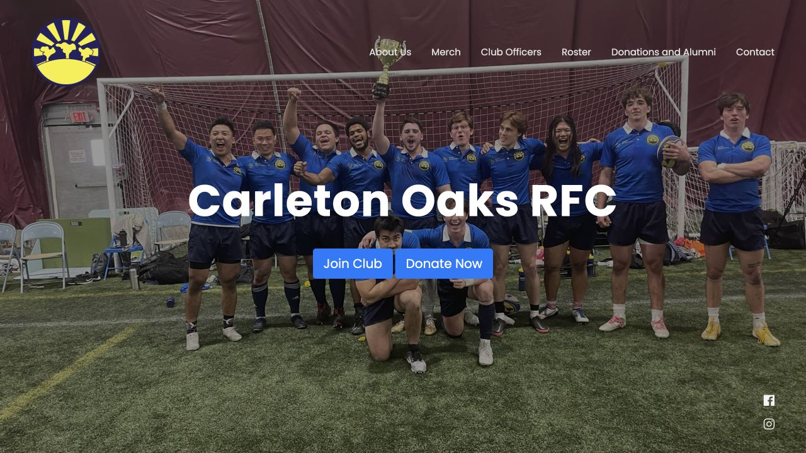
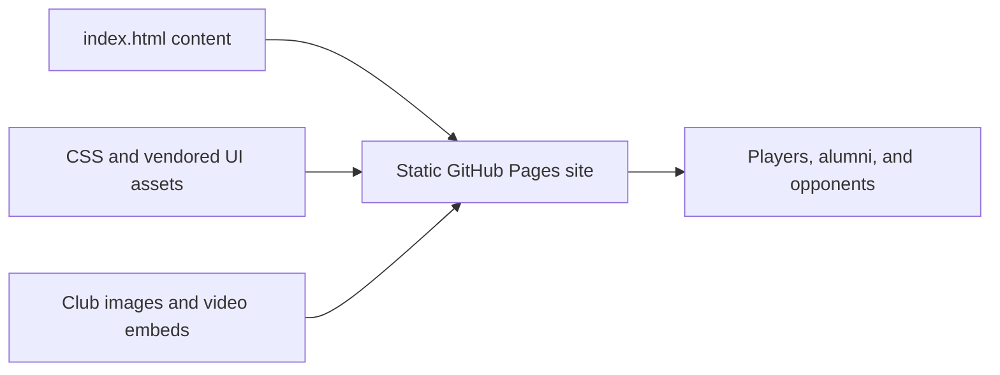

# Carleton Rugby Website

Static website for the Carleton College Men's Rugby Football Club. It presents club information, leadership, roster, merchandise, donation resources, highlights, and contact information for players, alumni, and prospective opponents.



## Architecture



There is intentionally no application server or database. GitHub Pages serves the repository root as a static site. Contact uses a direct club email link because PHP cannot execute on GitHub Pages.

## Run locally

No dependency installation or build step is required.

```bash
git clone https://github.com/bzhao-1/carleton-rugby-website.git
cd carleton-rugby-website
python3 -m http.server 8000
```

Open `http://localhost:8000`.

## Validate changes

```bash
python3 scripts/validate_site.py
```

The validator checks local image/script/style references, prevents server-side form actions, and guards against accidentally republishing private documents or a personal phone number. The same command runs in CI.

## Updating the site

- Edit club copy, officers, and roster in `index.html`.
- Store web-ready team images under `img/` and use descriptive `alt` text.
- Remove graduated players rather than retaining private player documents.
- Confirm club approval before publishing names, photos, or contact information.
- Test locally, run the validator, and check mobile and desktop layouts before pushing.

## Deployment

GitHub Pages publishes the `main` branch from the repository root. The live site is [bzhao-1.github.io/carleton-rugby-website](https://bzhao-1.github.io/carleton-rugby-website/).

## Maintenance status

This repository is kept as evidence of a real, long-running club website. It is not a systems or AI infrastructure project and is intentionally not pinned on the profile.

## License

Source code is available under the [MIT License](LICENSE). Club photographs, names, logos, and other media are not granted for reuse by the software license.
